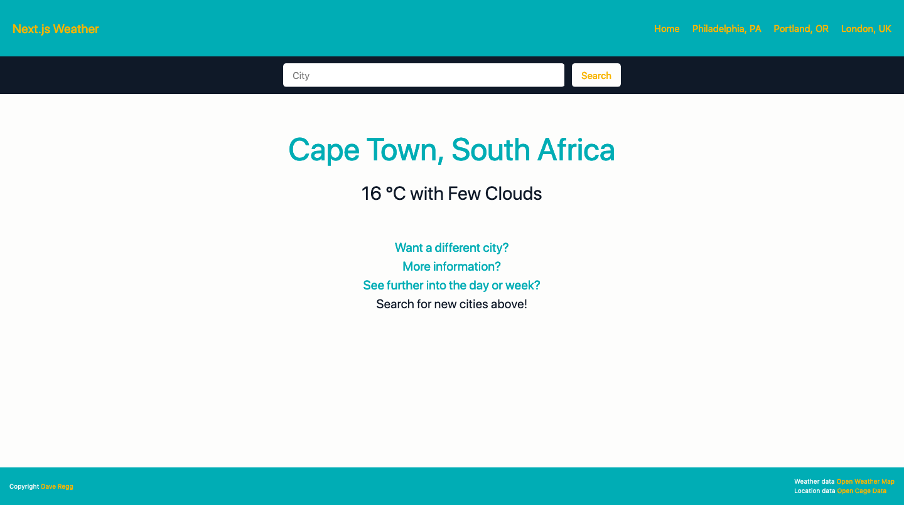
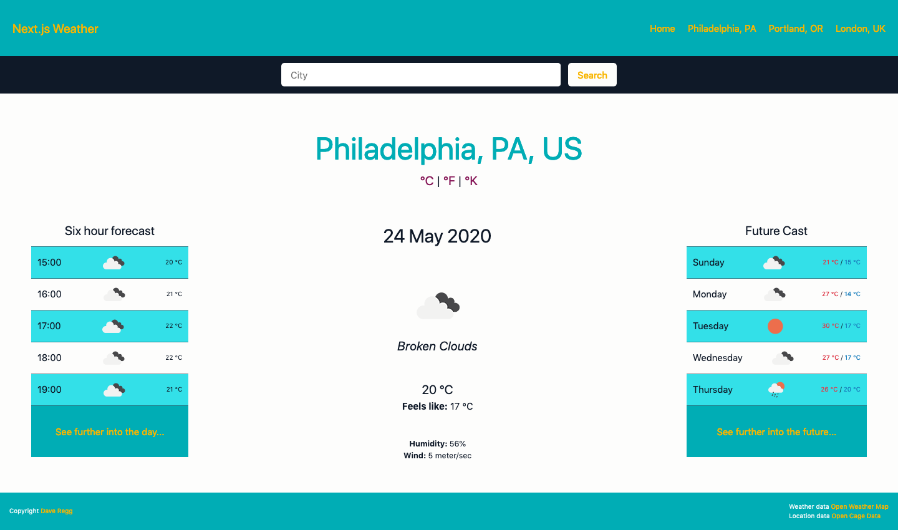

# Next.js Weather Application
> An app that allows you to search for weather around the globe! Using a weather API, a user can search for a city and have that city's weather instantly appear! The user may also navigate to additional information which can display a twelve-hour forecast, or a seven-day forecast.

## Table of contents
* [General info](#general-info)
* [Screenshots](#screenshots)
* [Technologies](#technologies)
* [Setup](#setup)
* [Features](#features)
* [Status](#status)
* [Inspiration](#inspiration)
* [Contact](#contact)

## General info
This application is created with [Next.js](https://www.nextjs.org) and [React.js](https://www.reactjs.org) and powered by [Open Weather Map](https://openweathermap.org) and [Open Cage Data](https://opencagedata.com). A user can search for a city in the search bar, and the city's latitude and longitude will be retrieved using Open Cage Data. React.js renders pages created in Next.js to retrieve data from Open Weather Map. A user can navigate to two separate pages to retrieve additional information - a twelve-hour forecast or a seven-day forecast. Information is, once again, retrieved with Open Weather Map using Next.js's Server Side Props function.

## Screenshots



## Technologies
* Node - version 12.3.1
* Node-fetch - version 2.6.0
* React - version 16.13.1
* Moment - version 2.26.0
* React-Moment - version 0.9.7
* Next - version 9.4.2
* Sass - version 1.26.5

## Setup
1. Clone the repo
```sh
git clone https://github.com/drregg6/nextjs-weather.git
```
2. Install NPM packages
```sh
npm install
```
3. Retrieve API keys from openweathermap and opencagedata
* [Open Weather Map](https://openweathermap.org/)
* [Open Cage Data](https://opencagedata.com/)

## Features
List of features ready and TODOs for future development
* Retrieve city latitude and longitude with [Open Cage Data](https://opencagedata.com)
* Retrieve weather data from [Open Weather Map](https://www.openweathermap.org)
* Allows user to swap between units - Kelvin, Celsius, and Fahrenheit. It will even change the wind speed between metric and empirical
* Allows users to show more information on separate pages

To-do list:
* Gather repeated functions into helper utility files
* Separate repeated Components
* Update styles for easier viewing on mobile

## Status
Project is: _in progress_ due to many adjustments that need to be made, especially for mobile. However, the project has been _launched_ and can be viewed [here](https://vast-sands-55489.herokuapp.com/)

## Inspiration
The project is a prompt on [freeCodeCamp](https://www.freecodecamp.org)

## Contact
Dave Regg - [@daveregg](https://www.twitter.com/daveregg) - dave.r.regg@gmail.com

Project Link: [https://github.com/drregg6/nextjs-weather](https://github.com/drregg6/nextjs-weather)